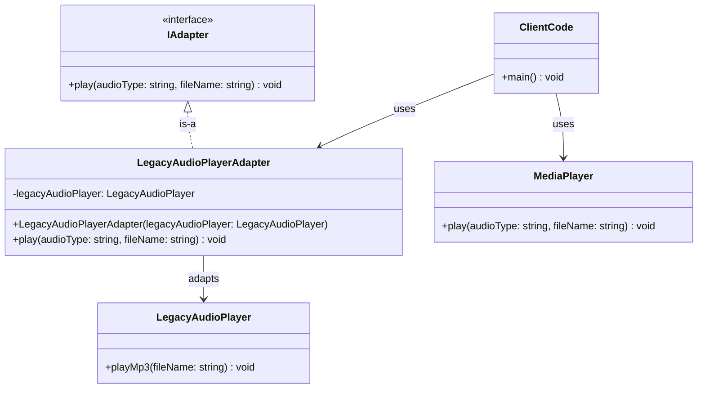

# Adapter Pattern

Used Incompatible interfaces makes them compatible together

 

```mermaid
classDiagram

    %% Interface
    class IAdapter {
        <<interface>>
        +play(audioType: string, fileName: string) void
    }

    %% Adapter
    class LegacyAudioPlayerAdapter {
        -legacyAudioPlayer: LegacyAudioPlayer
        +LegacyAudioPlayerAdapter(legacyAudioPlayer: LegacyAudioPlayer)
        +play(audioType: string, fileName: string) void
    }

    %% Legacy class
    class LegacyAudioPlayer {
        +playMp3(fileName: string) void
    }

    %% Modern class
    class MediaPlayer {
        +play(audioType: string, fileName: string) void
    }

    %% Client code
    class ClientCode {
        +main() void
    }

    %% Relationships
    IAdapter <|.. LegacyAudioPlayerAdapter : is-a
    LegacyAudioPlayerAdapter --> LegacyAudioPlayer : adapts
    ClientCode --> MediaPlayer : uses
    ClientCode --> LegacyAudioPlayerAdapter : uses
```
